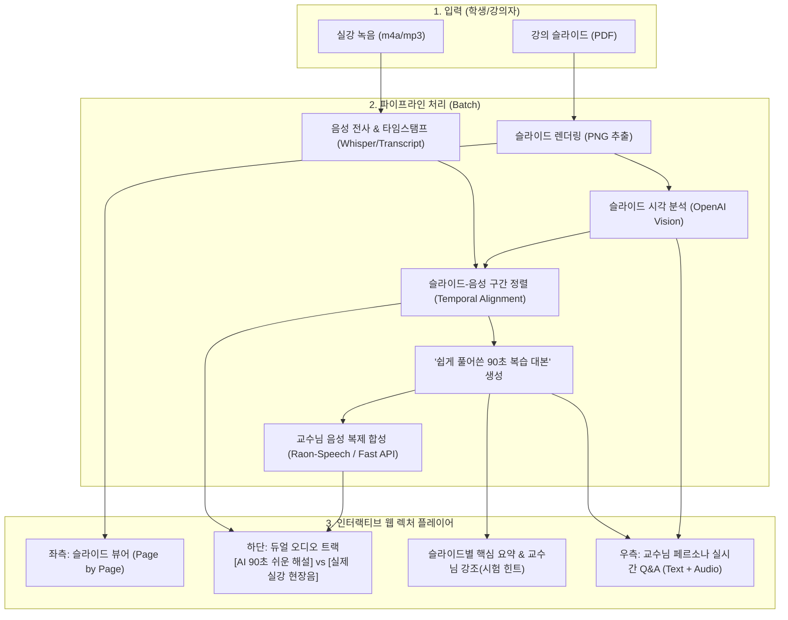

# 계획서: 복습용 인터랙티브 웹 렉처 플레이어 (Interactive Web Lecture Player)

## 1. 프로젝트 비전 및 배경

### 기존 방식의 문제점
* **기존 파이프라인**: PPT/PDF를 넣으면 전체 30분짜리 단일 MP4 비디오를 렌더링.
  * 단점: 비디오가 정적이고 길어서 학생이 필요한 부분만 찾아보기 힘들며, 수정 시 전체 재렌더링 필요.
* **학생들의 실강 복습 문제**:
  * 1시간 30분짜리 녹음 파일(클로바노트 등)은 텍스트가 너무 방대하여 시험 기간에 다시 읽을 엄두가 안 남.
  * 슬라이드의 시각 정보(그림, 도표)와 교수님의 음성 설명이 분리되어 있어 매칭이 어려움.

### 새로운 가치 제안 (Value Proposition)
> **"강의 슬라이드(PDF) + 수업 녹음(m4a)을 넣으면,  
> 슬라이드별 핵심을 1~2분 만에 쉽게 설명해주는 [AI 쉬운 해설]과 [실제 실강 음성]을 동시 제공하고,  
> 실시간으로 질문하면 교수님 톤으로 답변해 주는 인터랙티브 복습 플레이어"**

---

## 2. 시스템 아키텍처

---

## 3. 단계별 실행 계획 (Milestones)

### [Phase 1] 슬라이드-실강 매핑 및 90초 쉬운 해설 스크립트 검증
* **대상 데이터**:
  * 강의 자료: `data/PDF/AI현업문제해결/03-고객 문제 이해.pdf`
  * 실강 전사본: `data/transcripts/professor_full_lecture_32min.txt`
  * 타겟 슬라이드: **Page 30~31 (공감지도 사례: 쓰레기 불법투기 문제)**
* **작업 내용**:
  1. 슬라이드 30~31의 이미지 렌더링 및 VLM 시각 분석.
  2. 실강 32분 전사본에서 해당 슬라이드 발화 구간(1350s ~ 1590s) 추출.
  3. 실강의 장황한 구술을 **"학생들이 시험 직전에 90초 만에 완벽히 이해할 수 있는 구어체 쉬운 해설 대본"**으로 변환하는 LLM 프롬프트 설계 및 생성.
* **점검 기준**:
  - 교재 요약 말투(~합니다)가 아니라 친절한 교수님 구어체(~죠, ~거든요)인가?
  - 슬라이드 시각 정보와 실강 예시(쓰레기 불법투기 심리)가 잘 결합되었는가?

---

### [Phase 2] 듀얼 오디오(AI 쉬운 해설 + 실강 원본 조각) 생성
* **작업 내용**:
  1. **트랙 A (AI 쉬운 해설)**: Phase 1에서 생성된 90초 스크립트를 TTS(Raon-Speech / 레퍼런스 음성)로 합성.
  2. **트랙 B (실강 원본)**: `공감과디브리핑-AI활용현업문제해결-2025.m4a` 원본에서 해당 타임스탬프(22:30 ~ 26:30) 구간을 ffmpeg로 무손실 추출.
* **점검 기준**:
  - 두 오디오 트랙이 명확히 재생되는가?
  - 음질 및 볼륨 노멀라이제이션이 균일한가?

---

### [Phase 3] 인터랙티브 웹 플레이어 프로토타입 구현 및 Q&A 연동
* **작업 내용**:
  1. 웹 플레이어 단일 화면 UI (HTML5/CSS/Vanilla JS 또는 FastAPI 마운트):
     - 슬라이드 이미지 전환
     - 듀얼 오디오 플레이어 (원클릭 토글 재생)
     - 교수님이 강조한 "핵심 포인트 & 시험 힌트" 카드
     - 실시간 질문(Q&A) 챗봇 창
  2. 슬라이드 맥락 기반 실시간 Q&A 백엔드 엔드포인트 연동:
     - 슬라이드 내용 + 교수님 실제 발언을 컨텍스트로 주입하여 즉시 답변.
* **점검 기준**:
  - 브라우저에서 슬라이드, 오디오, 챗봇이 매끄럽게 작동하는가?
  - 질문했을 때 슬라이드 맥락을 정확히 이해하고 교수님 말투로 답변하는가?

---

## 4. 커밋 및 버전 관리 전략
* 각 Phase가 끝날 때마다 명확한 단위로 커밋:
  - `docs: add interactive lecture player prototype plan`
  - `feat(review): generate easy lecture script from slide and transcript`
  - `feat(audio): extract raw lecture segment and synthesize ai review audio`
  - `feat(player): implement interactive web lecture player prototype`
